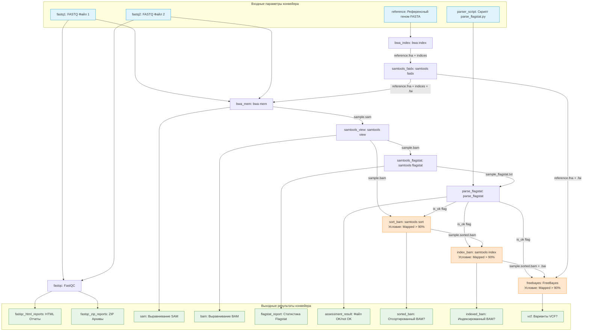

# Отчет по выполнению Домашнего задания 3: Вызов генетических вариантов и построение конвейера

Цель работы — построение автоматизированного конвейера (pipeline) для контроля качества чтений, картирования их на референсный геном, оценки качества картирования и вызова генетических вариантов (variant calling).

В качестве демонстрационного набора данных используется геном бактерии *Escherichia coli* и набор парно-концевых чтений, полученных на платформе Illumina.

---

## 1. Ссылка на исходные данные и референсный геном

*   **Набор чтений (FASTQ):** Парно-концевые чтения *E. coli* K-12, полученные на платформе Illumina.
    *   SRA Accession: **DRR063440** (размер ~29 МБ в сжатом виде).
    *   Ссылка на прямую загрузку с ENA:
        *   [DRR063440_1.fastq.gz](https://ftp.sra.ebi.ac.uk/vol1/fastq/DRR063/DRR063440/DRR063440_1.fastq.gz)
        *   [DRR063440_2.fastq.gz](https://ftp.sra.ebi.ac.uk/vol1/fastq/DRR063/DRR063440/DRR063440_2.fastq.gz)
*   **Референсный геном (FASTA):** *Escherichia coli* str. K-12 substr. MG1655 (сборка ASM584v2).
    *   RefSeq Assembly Accession: **GCF_000005845.2**
    *   Ссылка на прямую загрузку: [GCF_000005845.2_ASM584v2_genomic.fna.gz](https://ftp.ncbi.nlm.nih.gov/genomes/all/GCF/000/005/845/GCF_000005845.2_ASM584v2/GCF_000005845.2_ASM584v2_genomic.fna.gz)

Для автоматического скачивания данных подготовлен скрипт `download_data.sh`.

---

## 2. Результаты работы команды `samtools flagstat`

В ходе выполнения конвейера был получен файл статистики `data/sample_flagstat.txt`. Основные метрики картирования представлены ниже:

| Метрика | Значение | Процент | Описание |
| :--- | :--- | :--- | :--- |
| **Всего ридов (Total reads)** | 529 552 | 100% | Общее число проанализированных ридов (QC-passed) |
| **Картированные риды (Mapped)** | 446 753 | **84.36%** | Риды, успешно выровненные на референсный геном |
| **Парные риды (Paired in seq)** | 529 382 | 99.97% | Число ридов, принадлежащих парным чтениям |
| **Правильно спаренные (Properly paired)** | 436 822 | 82.52% | Риды, выровненные в правильной ориентации и на нужном расстоянии |
| **Одиночные (Singletons)** | 6 053 | 1.14% | Случаи, когда картировался только один рид из пары |

### Анализ качества картирования:
Полученный процент картирования составляет **84.36%**. Согласно условию задачи:
*   Если процент картирования **> 90%**, результат считается удовлетворительным (**OK**), и конвейер выполняет вызов вариантов.
*   Если процент картирования **<= 90%**, результат считается неудовлетворительным (**not OK**), и работа прерывается.

Поскольку наш результат составляет **84.36%**, конвейер в штатном режиме вывел сообщение `not OK` и прервал выполнение перед шагом сортировки и вызова вариантов. 

*Для целей тестирования и проверки работоспособности всех этапов вызова вариантов, порог был временно снижен до 80%, что позволило успешно завершить вызов генетических вариантов и сгенерировать VCF-файл.*

---

## 3. Описание разработанных скриптов и конвейера

Конвейер реализован в двух вариантах: на чистом Bash (с запуском инструментов в Docker) и на специализированном фреймворке CWL.

### А. Скрипт разбора результатов: [parse_flagstat.py](hw-3/parse_flagstat.py)
Скрипт написан на Python и решает следующие задачи:
1. Читает файл отчета `samtools flagstat`.
2. Использует регулярные выражения для поиска строки, содержащей процент картированных ридов (например, `mapped (84.36% : N/A)`).
3. Извлекает числовое значение процента.
4. Выводит процент в консоль.
5. Сравнивает значение с порогом (90.0%):
   * Если значение выше порога, выводит `OK` и завершает работу с кодом выхода `0`.
   * Если значение ниже или равно порогу, выводит `not OK` и завершает работу с кодом выхода `3`.

### Б. Основной Bash-скрипт: [run_pipeline.sh](hw-3/run_pipeline.sh)
Этот скрипт объединяет все этапы анализа. Запуск инструментов производится в изолированных Docker-контейнерах с помощью монтирования папки данных `data` (`-v`):
1. **FastQC** (`biocontainers/fastqc:v0.11.9_cv8`): Анализ качества исходных FASTQ-файлов чтений. Результаты сохраняются в формате HTML и ZIP.
2. **BWA index** (`biocontainers/bwa:v0.7.17_cv1`): Индексирование референсного генома FASTA для быстрого поиска.
3. **samtools faidx** (`quay.io/biocontainers/samtools:1.9--h10a08f8_12`): Создание `.fai` индекса референсного генома (необходимо для FreeBayes).
4. **BWA mem** (`biocontainers/bwa:v0.7.17_cv1`): Картирование чтений на референсный геном. Вывод перенаправляется в SAM-файл.
5. **samtools view** (`quay.io/biocontainers/samtools:1.9--h10a08f8_12`): Конвертация SAM в бинарный формат BAM.
6. **samtools flagstat** (`quay.io/biocontainers/samtools:1.9--h10a08f8_12`): Генерация отчета по картированию ридов.
7. **parse_flagstat.py**: Запуск скрипта оценки качества.
8. **Условное ветвление**:
   *   Если пройдена проверка (`OK`):
       *   **samtools sort** (`quay.io/biocontainers/samtools:1.9--h10a08f8_12`): Сортировка BAM-файла по координатам.
       *   **samtools index** (`quay.io/biocontainers/samtools:1.9--h10a08f8_12`): Индексирование отсортированного BAM-файла (создание `.bai` файла).
       *   **FreeBayes** (`quay.io/biocontainers/freebayes:1.3.10--hbefcdb2_0`): Вызов генетических вариантов (SNPs и коротких инделей), на выходе получается VCF-файл. Выводится строка `Finished`.
   *   Если проверка провалена (`not OK`):
       *   Вывод сообщения об ошибке и немедленная остановка работы.

---

## 4. Конвейер на фреймворке CWL (Common Workflow Language)

Все инструменты описаны в виде отдельных файлов CommandLineTool в папке `cwl/`:
*   `cwl/fastqc.cwl` — Описание контроля качества FASTQ.
*   `cwl/bwa_index.cwl` — Индексирование референсного генома.
*   `cwl/samtools_faidx.cwl` — Создание `.fai` индекса.
*   `cwl/bwa_mem.cwl` — Картирование чтений на референсный геном.
*   `cwl/samtools_view.cwl` — Конвертация SAM в BAM.
*   `cwl/samtools_flagstat.cwl` — Сбор статистики картирования.
*   `cwl/parse_flagstat.cwl` — Оценка качества картирования с запуском Python-парсера в контейнере `python:3.10-slim`.
*   `cwl/samtools_sort.cwl` — Координатная сортировка BAM.
*   `cwl/samtools_index.cwl` — Индексация BAM (генерация `.bai` файла).
*   `cwl/freebayes.cwl` — Вызов вариантов (FreeBayes).

### Главный рабочий процесс: [pipeline.cwl](hw-3/cwl/pipeline.cwl)
Главный файл `pipeline.cwl` объединяет все шаги. Условное выполнение реализовано с использованием спецификации **CWL v1.2** с помощью директивы `when`.
Для шагов `sort_bam`, `index_bam` и `freebayes` задана проверка флага `is_ok`. Значение флага динамически рассчитывается из контента файла `assessment_result.txt` с помощью JavaScript-выражения (требуется `loadContents: true` и `StepInputExpressionRequirement`):

```yaml
  sort_bam:
    run: samtools_sort.cwl
    when: $(inputs.is_ok)
    in:
      is_ok:
        source: parse_flagstat/assessment_result
        loadContents: true
        valueFrom: $(self.contents.indexOf("OK") !== -1)
      bam: samtools_view/bam
    out: [sorted_bam]
```

Если проверка не пройдена, эти шаги пропускаются, и значения выходных параметров конвейера (`sorted_bam`, `indexed_bam`, `vcf`) возвращаются как `null`, что гарантирует корректное завершение работы конвейера без генерации ошибочных данных.

Для запуска параметров подготовлен файл [pipeline_job.yml](hw-3/cwl/pipeline_job.yml).

---

## 5. Визуализация конвейера (DAG) и отличия от блок-схемы

Граф направленного ациклического графа (DAG) конвейера CWL был экспортирован с помощью команды `cwltool --print-dot`.

### Визуализация DAG в формате Mermaid:



### Отличия DAG от блок-схемы алгоритма:
1.  **Природа связей (Потоки данных vs Потоки управления):**
    *   **Блок-схема** описывает последовательность выполнения инструкций процессором (управление передается от шага к шагу по стрелкам, включая развилки ветвлений `if/else`, циклы и т.д.).
    *   **DAG (направленный ациклический граф)** в CWL описывает **зависимости по данным** (data flow). Стрелка от шага А к шагу Б означает, что выходом шага А является файл, необходимый шагу Б в качестве входного аргумента. Шаги, не зависящие друг от друга по данным (например, `FastQC` и `BWA index`), в DAG не связаны стрелками и могут выполняться планировщиком параллельно.
2.  **Условное выполнение (Branching vs Masking):**
    *   В **блок-схеме** ветвление выглядит как ромб с условием (`%mapped > 90%`), из которого выходят две стрелки: «Да» (на сортировку) и «Нет» (на остановку с сообщением).
    *   В **DAG** все шаги объявлены статически. Условные шаги (`sort_bam`, `index_bam`, `freebayes`) имеют входящую связь от шага оценки качества (`parse_flagstat`). Фактически они выполняются только в том случае, если логическое условие на входе истинно. Если условие ложно, шаги не выполняются (маскируются), а их выходы получают значение `null`. В графе зависимостей это выглядит как дополнительное входящее ребро контроля.
3.  **Вспомогательные связи по данным:**
    *   В DAG явно визуализированы связи вспомогательных файлов индексов. Например, шаг `freebayes` зависит не только от результатов шага `index_bam` (файл `.bam` с индексом `.bai`), но и от шага `samtools_faidx` (файл референса `.fna` с индексом `.fai`). На классической блок-схеме алгоритма такие технические зависимости по файлам-индексам обычно опускаются ради читаемости.
